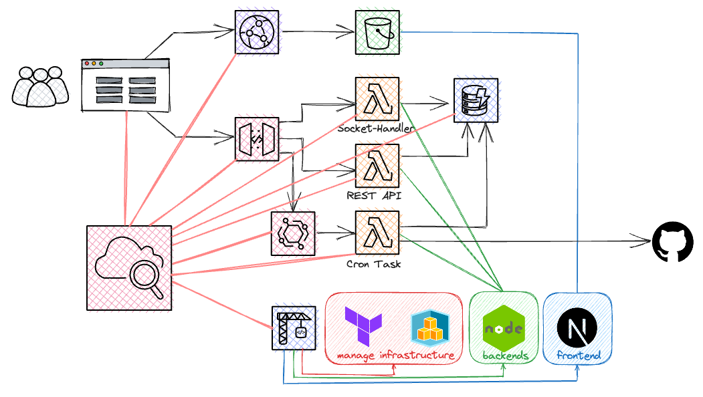
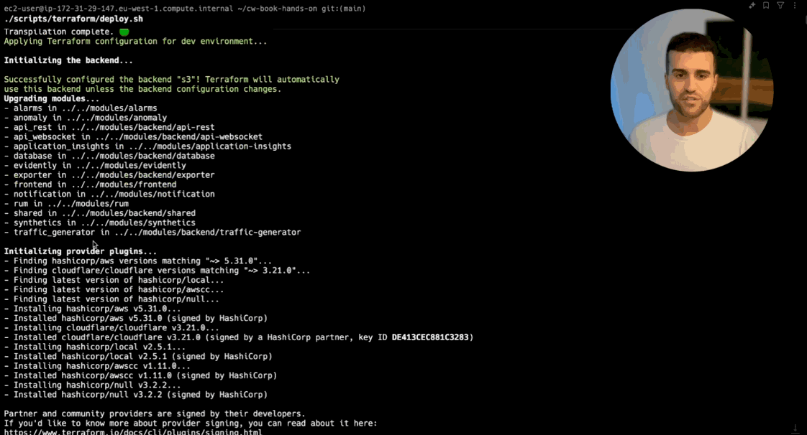

== The Github Repository Tracker

First things first: thank you for buying our book!
We're excited to have you on board.

This guide will help you set up the necessary tools to deploy the code from the repository included in the CloudWatch Book into your own AWS account.

We'll provide instructions for macOS, Linux, and Windows. If you're using a different operating system, you can follow the instructions for Linux, as they are the most similar to other Unix-based systems.

=== Further Reading

**TL;DR**: use `./scripts/deploy.sh [cdk|tf]` to automatically set up everything (this will also install necessary tools) and deploy the infrastructure and frontend application. 🤖

We've also recorded a video for you to follow along:

If you want to have a deeper look into the steps, please read the following documents:

* link:docs/tooling.adoc[⚒️ Installing All the Necessary Tools]:
 Learn how to install the necessary tools that we use.

* link:docs/cdk.adoc[💛 Setting Up CDK]:
 Learn how to deploy the infrastructure with the CDK track.

* link:docs/terraform.adoc[💜 Setting Up Terraform]:
 Learn how to deploy the infrastructure with the Terraform track.